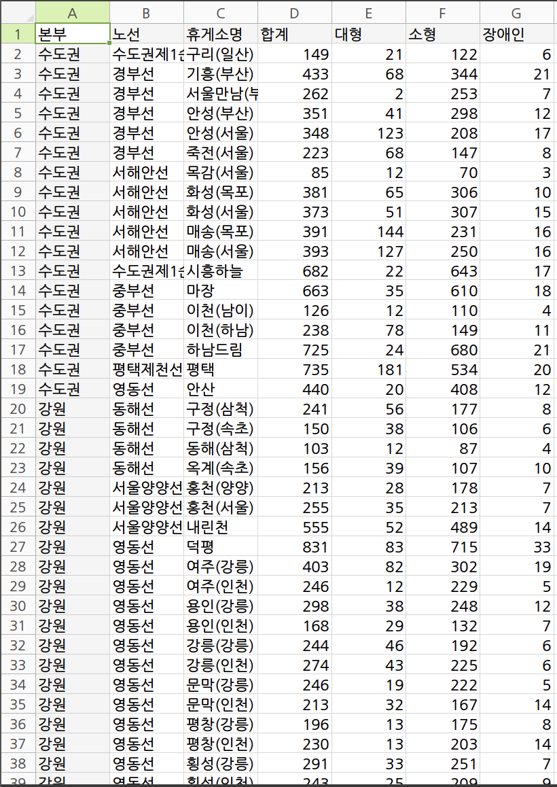

6일차!

# 데이터
데이터, 정보, 지식, 지혜를 구분해서 생각해보자.  
단순 데이터를 사용해서 의미를 도출해보는 과정을 진행할 수 있다.  
ex) 휴게소 주차장 현황
> 기본 데이터

- 알 수 있는 정보
> 대부분 소형 자동차를 위한 공간이 많다.  
> 덕평 주차장의 주차 대수가 가장 많다.  
> 매송에 대형 주차가 많으므로 택배 관련 업무가 많을 것이다.
- 지식
> 주차 대수가 많을수록 휴게소 주차장의 크기가 크다.
- 지혜 
> 매송 휴게소에서 택배 관련 업무가 많다면 주변에 물류 창고가 있을 것이다.  
> 개선사항 등...
